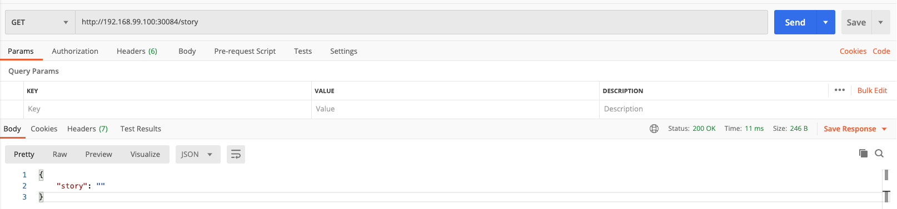
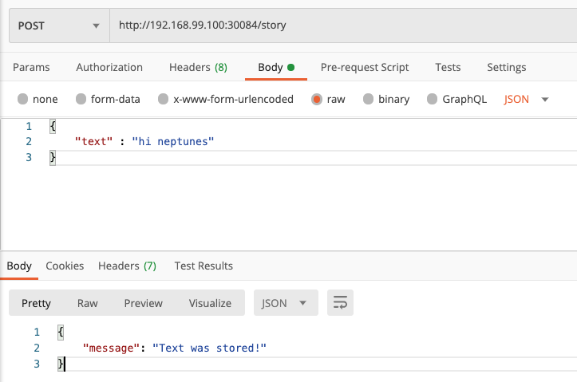
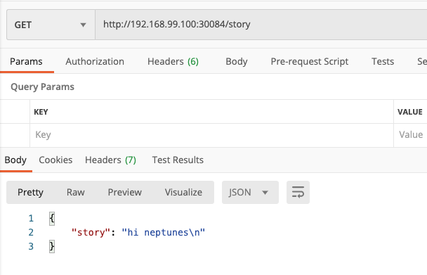
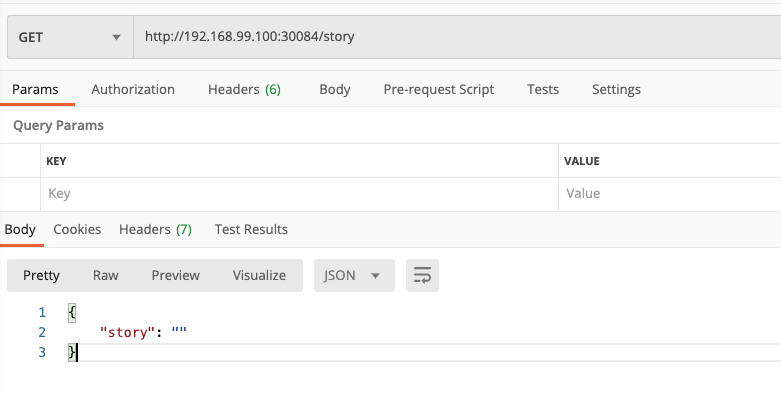
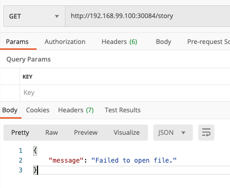
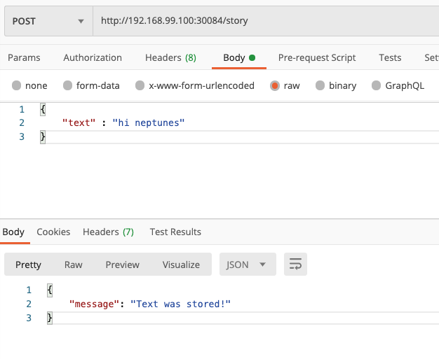
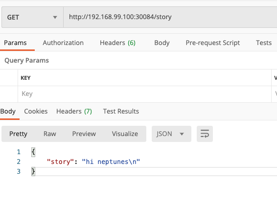

# kube-volume-starter
* 쿠버네티스 불륨 사용해보기


## Volume 적용 X

### Dockerfile로 이미지 빌드하기

1. `Dockerfile` 로 이미지 빌드

2. 도커 허브에 푸시

```dockerfile
#Dockerfile
FROM node:14-alpine

WORKDIR /app

COPY package.json .

RUN npm install

COPY . .

EXPOSE 3000

CMD [ "node", "app.js" ]
```

```shell
ls
Dockerfile          app.js              docker-compose.yaml service.yaml
README.md           deployment.yaml     package.json        story
# 도커 이미지 빌드
docker build -t neptunes032/kub-data-demo:1 .
# 도커 허브에 푸시
docker push neptunes032/kub-data-demo:1
```


### deployment.yaml 정의

```yaml
apiVersion: apps/v1
kind: Deployment
metadata:
  name: story-deployment
spec:
  replicas: 1
  selector:
    matchLabels:
      app: story
  template:
    metadata:
      labels:
        app: story
    spec:
      containers:
        - name: story
          image: neptunes032/kub-data-demo:1

```


### service.yaml 정의

```yaml
apiVersion: v1
kind: Service
metadata:
  name: story-service
spec:
  selector:
    app: story
  ports:
    - protocol: "TCP"
      port: 80
      targetPort: 3000
  type: LoadBalancer
 
```


### deployment 와 service 리소스 생성

```shell
# 리소스들 생성
kubectl apply -f deployment.yaml -f service.yaml

# 서비스 생성 확인
kubectl get service
NAME            TYPE           CLUSTER-IP       EXTERNAL-IP   PORT(S)        AGE
kubernetes      ClusterIP      10.96.0.1        <none>        443/TCP        4d1h
story-service   LoadBalancer   10.102.0.140     <pending>     80:30084/TCP   22h

minikube service story-service
|-----------|---------------|-------------|-----------------------------|
| NAMESPACE |     NAME      | TARGET PORT |             URL             |
|-----------|---------------|-------------|-----------------------------|
| default   | story-service |          80 | http://192.168.99.100:30084 |
|-----------|---------------|-------------|-----------------------------|
🎉  Opening service default/story-service in default browser...
```


### postman으로 동작 확인하기

1. GET http://192.168.99.100:30084/story




2. POST http://192.168.99.100:30084/story



3. GET http://192.168.99.100:30084/story



### 문제점

* 컨테이너를 재시작하면 데이터가 사라진다.

1. GET http://192.168.99.100:30084/story


2. GET http://192.168.99.100:30084/error

   * 앱을 종료시킨다
   * 쿠버네티스가 컨테이너 를 재시작한다.

   ```javascript
   app.get('/error', () =>{
     process.exit(1);
   })
   ```

   

3. GET http://192.168.99.100:30084/story

   * 컨테이너를 재시작하니 데이터가 사라졌다.




## emptyDir 적용하기

### emptyDir volume

* 해당 노드에서 실행중인 pod와 생명주기가 같다.
  * Pod가 제거되면 emptyDir volume 또한 영구적으로 제거된다.
* 초기에는 비어있다.
* 한 파드안에 있는 모든 컨테이너가 emptyDir volume의 같은 파일을 읽고 쓸 수 있다.

```yaml
apiVersion: apps/v1
kind: Deployment
metadata:
  name: story-deployment
spec:
  replicas: 1
  selector:
    matchLabels:
      app: story
  template:
    metadata:
      labels:
        app: story
    spec:
      containers:
        - name: story
          image: neptunes032/kub-data-demo:2
          volumeMounts:
            - mountPath: /app/story
              name: story-volume
      volumes:
        - name: story-volume
          emptyDir: {}
```

```shell
kubelctl apply
```


### postman으로 동작 확인하기

1. GET http://192.168.99.100:30084/story

   

2. POST http://192.168.99.100:30084/story

   

3. GET http://192.168.99.100:30084/story



4. GET http://192.168.99.100:30084/error

   * 컨테이너 재시작

5. GET http://192.168.99.100:30084/story

   * 컨터이너 재시작에도 데이터가 지워지지 않았다.

   

> **Note:** A container crashing does *not* remove a Pod from a node. The data in an `emptyDir` volume is safe across container crashes.

### emptyDir의 문제점

* deployment.yaml 에서 repilcas를 2로 바꾼다.

1. GET http://192.168.99.100:30084/story
   * 정삭작동
2. GET http://192.168.99.100:30084/error
3. GET http://192.168.99.100:30084/story
   * 요청이 다른 pod으로 가기때문에 기존 데이터를 로드할 수 없다.
   * 데이터 접근불가


## hostPath 적용하기

### hostPath

* 호스트 노드의 파일이나 디렉토리를 `pod` 에 마운트 시킨다.

```yaml
apiVersion: apps/v1
kind: Deployment
metadata:
  name: story-deployment
spec:
  replicas: 2
  selector:
    matchLabels:
      app: story
  template:
    metadata:
      labels:
        app: story
    spec:
      containers:
        - name: story
          image: neptunes032/kub-data-demo:2
          volumeMounts:
            - mountPath: /app/story
              name: story-volume
      volumes:
        - name: story-volume
          hostPath:
            path: /data
            type: DirectoryOrCreate

```

```shell
kubectl apply -f deployment.yaml
```


### exi동작 확인하기

1. GET http://192.168.99.100:30084/story
   * 정삭작동
2. GET http://192.168.99.100:30084/error
3. GET http://192.168.99.100:30084/story
   * 정상작동

```shell
$ minikube ssh
$ cat /data/text.txt
hi neptunes
```


### hostPath의 장점

* 호스트의 데이터를 컨테이너로 공유하고 싶을 때 유용하다.


### hostPath의 문제점

* 다수의 워커노드가 있을 경우 pod들이 다른 노드들에서 실행될 경우 같은 데이터에 접근 할 수 없다.
* 같은 노드에서 실행되는 pod끼리만 데이터를 액세스 할 수 있다.

